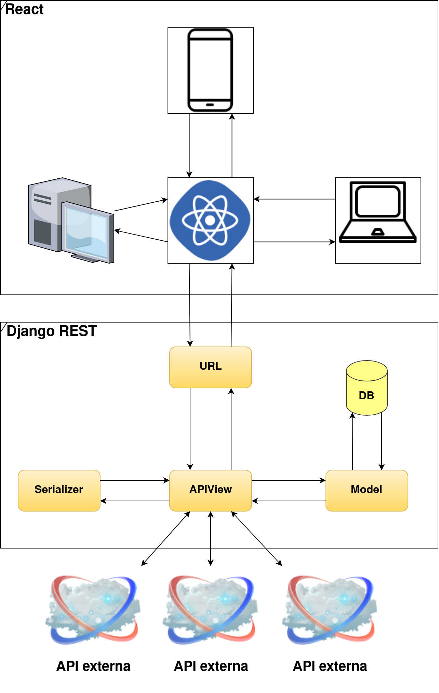

# Projeto Arquitetural

*********

#### **UNIVERSIDADE FEDERAL DO RIO GRANDE DO NORTE**

#### **CENTRO DE ENSINO SUPERIOR DO SERIDÓ**

#### **DEPARTAMENTO DE COMPUTAÇÃO E TECNOLOGIA**

#### **CURSO DE BACHARELADO EM SISTEMAS DE INFORMAÇÃO**

**José Geraldo de Medeiros Júnior**  
**Paulo Vitor de Medeiros Brito**  
**Pedro Jonas da Silva Medeiros**  

### **GamingTrack**

**Caicó – RN**  
**2020**  

*********
*********

## Sumário

1. [Descrição](#descricao)
     1. [Histórico de Revisões](#revisoes)
2. [Visão Geral](#visao)
3. [Requisitos Não Funcionais](#requisitos)
4. [Mecanismos Arquiteturais](#mecanismo)
    1. [Tecnologias](#tecnologias)
5. [Decisões de Design](#design)
6. [Validações com Casos de Teste](#validacao)
7. [Componentes](#componentes)
8. [Implantação](#implantacao)
9. [Referências](#referencias)

*********

*********

 

## Descrição

Descrição do documento. Focar no conteúdo.

 

### **Histórico de Revisões**

| Data | Versão | Descrição | Autor|
| :--- | :----: | :-------- | :--- |
13/10/2020 | 1.0 | Documento inicial | Paulo Vítor de Medeiros Brito

[Topo](#sumario)
*********

*********

 

## Visão Geral

### Back-end

O back-end do projeto será desenvolvido na linguagem de programação [Python](www.python.org/) e utilizando o [Framework Django REST](www.django-rest-framework.org/) que é uma variação do [Framework Django](www.djangoproject.com/). 

* **Model**

A model é a representação dos objetos, permitindo obter informações do banco de dados sem conhecer a complexidade de tal. Essa camada contém tudo sobre os dados: como acessar, validar, comportamentos e relações entre dados.

* **View**

A view controla o fluxo de informações entre a model e o mundo externo. Essa camada utiliza lógica programada para decidir quais informações serão extraídas do banco de dados e quais serão transmitidas para exibição.

* **Serializer**

Os serializers permitem que dados complexos sejam convertidos em tipos de dados nativos do python, que podem ser renderizados facilmente em JSON, XML e outros tipos de conteúdo. No Django Rest, os serializers funcionam de forma semelhante às classes Form e ModelForm do Django.

* **URL**

O framework REST tem suporte para o roteamento automático de URL para o Django, e fornece uma forma simples, rápida e consistente de conectar sua lógica de visualização a um conjunto de URLs.

### Front-end

O front-end será desenvolvido utilizando a linguagem JavaScript com React consumindo a API criada.
Espera-se que tenhamos uma a página web bem organizada e compatível com os diversos navegadores que tenham suporte ao JavaScript.

[Topo](#sumario)
*********

*********

 

## Requisitos não funcionais

Requisitos não-funcionais: nesta fase do documento, é necessário listar os requisitos não funcionais encontrados no sistema, tais como: portabilidade, usabilidade, desempenho e etc. O objetivo é colocar o nome do requisito e descrever com detalhes suas características.

|  |  |
| ---------- | ------ |
| Desempenho | 1. A pagina principal tem que ser carregada em no máximo 3 segundos com uma conexão mínima de 256kbps.
|Interoperabilidade| 1. Deve ser desenvolvido na plataforma .NET com banco de dados SQL Server Enterprise ou Oracle 10g.

[Topo](#sumario)
*********

*********

 

## Mecanismos arquiteturais

Nesta fase do documento, devemos listar os mecanismos arquiteturais encontrados no sistema, ou seja, identificar todos os mecanismos de análise, mecanismo de design e mecanismo de implementação. O intuito desta etapa é verificar e garantir que todas as preocupações técnicas relativas à arquitetura do sistema tenham sido capturadas.

| Mecanismo de Análise | Mecanismo de Design | Mecanismo de Implementação |
| -------------------- | ------------------- | -------------------------- |
|Persistência| Banco de dados relacional     | SQL Server Enterprise
Integração com sistemas legados (Cobrança) | Interface utilizando XML em serviço e arquivo texto. | Web Service e System.IO
Log | Implementação dos recursos de log do componente de persistência. | ADO.NET

[Topo](#sumario)
*********

*********

### **Tecnologias**

Detalhar as tecnologias utilizadas na implementação.

[Topo](#sumario)
*********

*********

## Decisões de Design

**Fundamentação:** nesta fase, o arquiteto deve fundamentar todas as decisões importantes de design. Além disso, deve descrever as alternativas significativas rejeitadas no projeto. Esta seção pode indicar hipóteses, restrições, resultados de análises e experiências significativas para a arquitetura.

Por exemplo:

- Porque utilizar arquitetura REST?
- Porque utilizar arquitetura monolítica e não de micro-serviço?

[Topo](#sumario)
*********

*********

## Validação com Casos de Teste

Nesta fase selecionar User Stories com cenários escolhidos para a validação da arquitetura apresentada. Casos de uso, backlog, requisitos de usuários ou qualquer outro nome que represente os itens relevantes para o funcionamento do sistema final, o intuito é exercitar e testar os principais aspectos de risco da arquitetura.

| User Story | Motivos da escolha  |
| ---------- | ------ |
| US 01 | Descrever o motivo e os itens que serão testados.
| US 04 | -

[Topo](#sumario)
*********

*********

## Componentes

Nesta fase, o arquiteto deve apresentar o diagrama de componentes. É recomendado como boas práticas de mercado o uso do modelo UML para criação do diagrama, que deve apresentar os possíveis componentes e suas dependências. Além disso, o arquiteto deve criar uma tabela detalhando as responsabilidades de cada componente.

Exemplo:
| Componente | Descrição  |
| ---------: | ---------- |
| BackOffice | Descrever de forma sucinta as responsabilidades deste componente...
|Assinante   | 
|Serviço     |
| Financeiro |
|Pesquisa    |
|Suporte     |
|Log         |
|Segurança   |

## Implantação

O arquiteto deve descreve as configurações de distribuição dos componentes de software na área física em que serão implantados.

Exemplo:

[Topo](#sumario)

*********
*********

 

## Referências

(coloque aqui, artigos, livros e sites utilizados e citados no documento)

[Topo](#sumario)
*********
