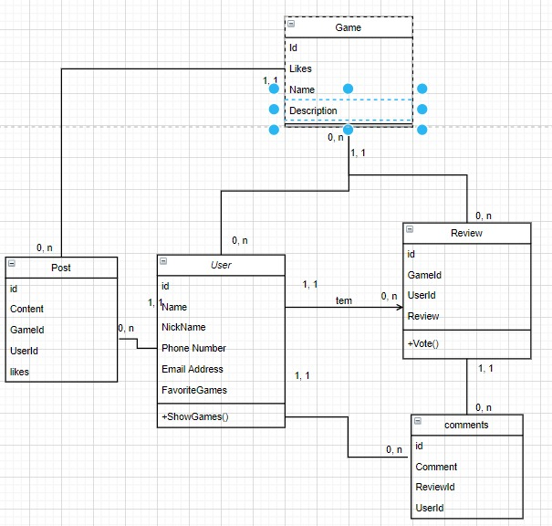

# Documento de Modelos

Neste documento se encontram os modelos e diagramas do sistema.

## Diagrama Entidade-Relacionamento (DER)

## Diagrama de Classes (UML)

### Descrição das Entidades

Entidade     | Descrição
------------- ----------
User         | Usuário que se cadastra para utilizar o sistema. Pode publicar posts e reviews sobre seus jogos favoritos, como também comentar publicações de outros usuários.
Game         | Jogo eletrônico. As informações dos jogos serão obtidas através da API do Internet Games Database (IGDB). Pode receber reviews de jogadores, como também ser marcado em posts dos usuários.
Review       | Resenha e/ou comentário dos usuários sobre um jogo.
