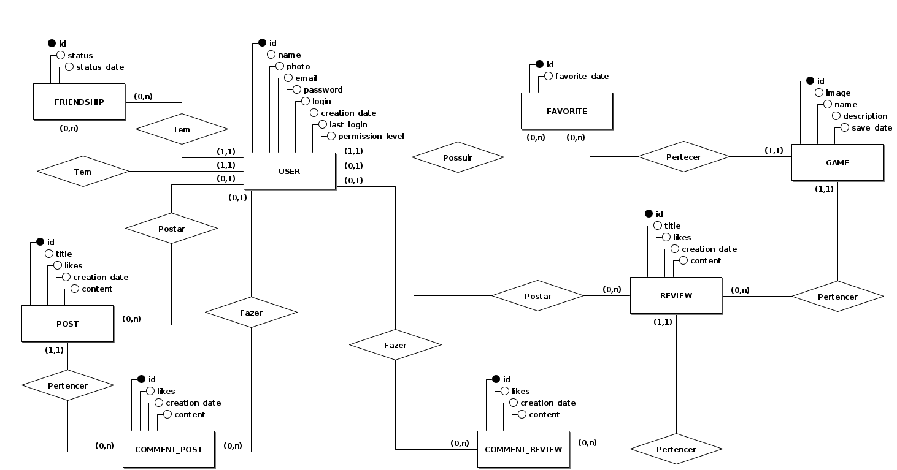

# Documento de Modelos

Neste documento se encontram os modelos e diagramas do sistema.

## Diagrama Entidade-Relacionamento (DER)

## Diagrama de Classes (UML)

&nbsp;

### Descrição das Entidades

| Entidade | Descrição |
| -------- | --------- |
| User    | Usuário que se cadastra para utilizar o sistema. Pode publicar posts e reviews sobre seus jogos favoritos, como também comentar publicações de outros usuários. |
| Game    | Jogo eletrônico. As informações dos jogos serão obtidas através da API do Internet Games Database (IGDB). Pode receber reviews de jogadores, como também ser marcado em posts dos usuários. |
| Review  | Resenha e/ou comentário dos usuários sobre um jogo. |

&nbsp;

### Dicionário de Dados  

&nbsp;

**Tabela USER**  

| Nome do Campo | Chave | Restrição | Tipo de dado | Descrição do Campo | 
| :------------ | :---: | :-------: | :----------: | :----------------- |
| id | PK | NN | INT | Identificador único da tabela |
| name | -- | -- | VARCHAR | Nome do usuário |
| photo | -- | -- | BYTEA | Imagem que o usuário define para seu perfil. |
| e-mail | -- | NN/U | VARCHAR | Endereço de e-mail cadastrado para recuperação de senha ou login |
| login | -- | NN/U | VARCHAR | Senha armazenada em formato de hash que será validado para login |
| creation_date | -- | NN | TIMESTAMP | Data e hora completa de criação do usuário autogerada pela aplicação |
| last_login | -- | NN | TIMESTAMP | Data e hora completa do ultimo login do usuário autogerada pela aplicação |
| permission_level | -- | NN | INT | Tipo de permissão de acesso ao sistema, sendo gerado pelo auto registro com um número predefino que fornece acesso como usuário comum. Posteriormente esse valo pode ser alterado para um valor associado a moderador ou outros cargos a serem definidos posteriormente mediante necessidade.  |
| | | | | |

&nbsp;

**Tabela FAVORITE**

| Nome do Campo | Chave | Restrição | Tipo de dado | Descrição do Campo |
| :------------ | :---: | :-------: | :----------: | :----------------- |
| id | PK | NN | INT | Identificador único da tabela |
| favorite_date | -- | NN | TIMESTAMP | Data e hora completa de adição do game aos favoritos autogerada pela aplicação |
| FK_USER_id | FK | NN | INT | Chave estrangeira que liga um usuário a lista de favoritos. Caso seja deletado o usuário, os favoritos dele serão excluidos (ON DELETE CASCADE) |
| FK_GAME_id | FK | NN | INT | Chave estrangeira que liga um game a lista de favoritos de um usuário. Caso seja deletado o game, os favoritos que ele era referenciado também serão excluídos (ON DELETE CASCADE) |
| | | | | |

&nbsp;

**Tabela GAME**

| Nome do Campo | Chave | Restrição | Tipo de dado | Descrição do Campo |
| :------------ | :---: | :-------: | :----------: | :----------------- |
| id | PK | NN | INT | Identificador único da tabela |
| name | -- | NN | VARCHAR | Nome do game |
| photo | -- | -- | BYTEA | Uma imagem relativa ao game |
| save_date | -- | NN | TIMESTAMP | Data e hora completa da inclusão de um game no banco de dados autogerada pela aplicação |
| description | -- | NN | TEXT | Descrição do game |
| | | | | |

&nbsp;

**Tabela POST**

| Nome do Campo | Chave | Restrição | Tipo de dado | Descrição do Campo |
| :------------ | :---: | :-------: | :----------: | :----------------- |
| id | PK | NN | INT | Identificador único da tabela |
| likes | -- | NN | INT | Quantidade de vezes que os usuários curtiram uma postagem. Default é 0 |
| content | -- | NN | TEXT | Texto da postagem, a quantidade de caracteres pode ser limitada |
| title | -- | NN | VARCHAR | Título da postagem, a quantidade de caracteres pode ser limitada |
| creation_date | -- | NN | TIMESTAMP | Data e hora completa de criação da postagem autogerada pela aplicação |
| FK_USER_id | FK | -- | INT | Chave estrangeira que liga uma postagem a um usuário. Caso seja deletado o usuário, as postagens dele permanecerão (ON DELETE SET NULL) |
| | | | | |

&nbsp;

**Tabela REVIEW**

| Nome do Campo | Chave | Restrição | Tipo de dado | Descrição do Campo |
| :------------ | :---: | :-------: | :----------: | :----------------- |
| id | PK | NN | INT | Identificador único da tabela |
| likes | -- | NN | INT | Quantidade de vezes que os usuários curtiram um review. Default é 0 |
| content | -- | NN | TEXT | Texto do review, a quantidade de caracteres pode ser limitad  |
| title | -- | NN | VARCHAR | Título da review, a quantidade de caracteres pode ser limitada |
| creation_date | -- | NN | TIMESTAMP | Data e hora completa de criação do review autogerada pela aplicação |
| FK_USER_id | FK | -- | INT | Chave estrangeira que liga um review a um usuário. Caso seja deletado o usuário, os review dele permanecerão (ON DELETE SET NULL) |
| FK_GAME_id | FK | NN | INT | Chave estrangeira que liga um game a um review. Caso seja deletado o game, os review dele são apagados (ON DELETE CASCADE) |
| | | | | |

&nbsp;

**Tabela COMMENT_REVIEW**

| Nome do Campo | Chave | Restrição | Tipo de dado | Descrição do Campo |
| :------------ | :---: | :-------: | :----------: | :----------------- |
| id | PK | NN | INT | Identificador único da tabela |
| likes | -- | NN | INT | Quantidade de vezes que os usuários curtiram um comentário. Default é 0 |
| content | -- | NN | TEXT | Texto do comentário, a quantidade de caracteres pode ser limitada |
| creation_date | -- | NN | TIMESTAMP | Data e hora completa de criação do comentário autogerada pela aplicação |
| FK_REVIEW_id | FK | NN | INT | Chave estrangeira que liga um comentário a um review. Caso seja deletada o review, os cometário dele são apagados (ON DELETE CASCADE) |
| FK_USER_id | FK | -- | INT | Chave estrangeira que liga um comentário a um usuário. Caso seja deletado o usuário, os cometário dele permanecerão (ON DELETE SET NULL) |
| | | | | |

&nbsp;

**Tabela COMMENT_POST**

| Nome do Campo | Chave | Restrição | Tipo de dado | Descrição do Campo |
| :------------ | :---: | :-------: | :----------: | :----------------- |
| id | PK | NN | INT | Identificador único da tabela |
| likes | -- | NN | INT | Quantidade de vezes que os usuários curtiram um comentário. Default é 0 |
| content | -- | NN | TEXT | Texto do comentário, a quantidade de caracteres pode ser limitada |
| creation_date | -- | NN | TIMESTAMP | Data e hora completa de criação do comentário autogerada pela aplicação |
| FK_POST_id | FK | NN | INT | Chave estrangeira que liga um comentário a uma postagem. Caso seja deletada a postagem, os cometário dela são apagados (ON DELETE CASCADE) |
| FK_USER_id | FK | -- | INT | Chave estrangeira que liga um comentário a um usuário. Caso seja deletado o usuário, os cometário dele permanecerão (ON DELETE SET NULL) |
| | | | | |

&nbsp;

**Tabela FRIENDSHIP**

| Nome do Campo | Chave | Restrição | Tipo de dado | Descrição do Campo |
| :------------ | :---: | :-------: | :----------: | :----------------- |
| id | PK | NN | INT | Identificador único da tabela |
| status | -- | NN | BOOLEAN | Define se um usuário é amigo de outro (TRUE) ou não é amigo (FALSE). |
| status_date | -- | NN | TIMESTAMP | Data e hora completa da ultima alteração do status de amizade de um usuário com outro, autogerada pela aplicação |
| FK_USER_id | -- | NN | INT | Chave estrangeira que liga um usuário a outro na tabela de amizade. Caso qualquer deles for excluído, a entrada na tabela também será excluída (ON DELETE CASCADE) |
| FK_USER_id | -- | NN | INT | Chave estrangeira que liga um usuário a outro na tabela de amizade. Caso qualquer deles for excluído, a entrada na tabela também será excluída (ON DELETE CASCADE) |
| | | | | |

&nbsp;

#### **Legenda**

&nbsp;
| | |
|-|-|
|PK|Primary Key|
|FK|Foreigh Key|
|NN|Not Null|
|U|Unique|
| | |
